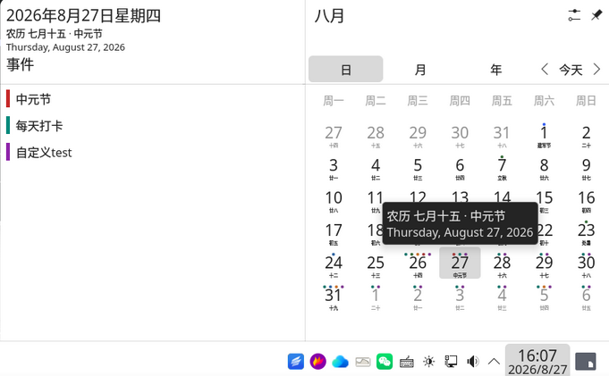
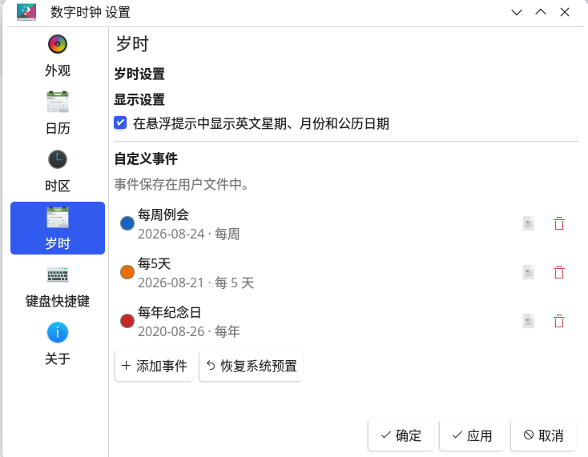
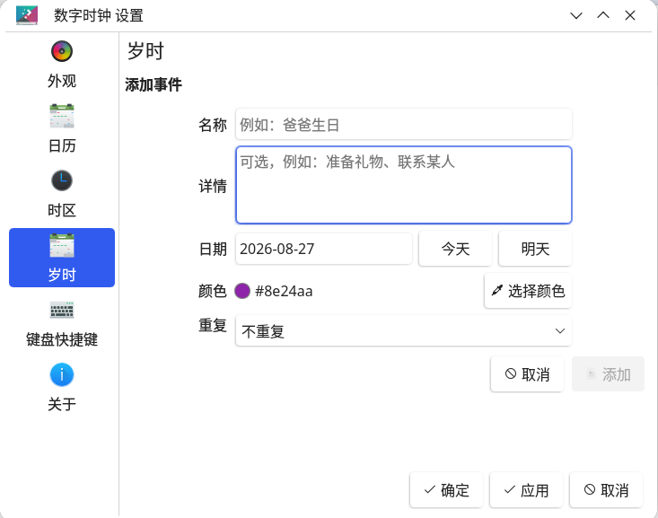
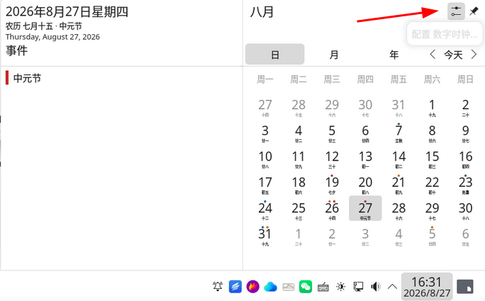
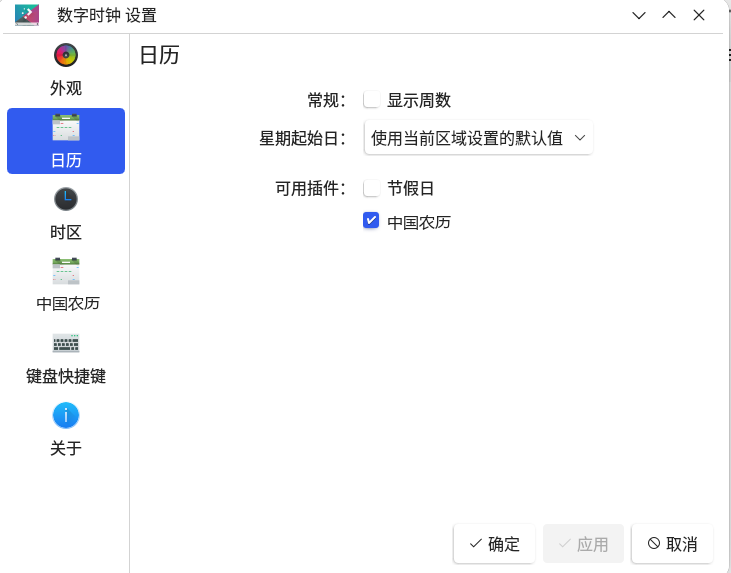

# Chinese Lunar Calendar for KDE

KDE Plasma 6 的中国农历日历插件。它不额外创建日历窗口，而是直接增强系统数字时钟的月历：在每个阳历日期下方显示农历、节气、节日与调休信息。

## 测试状态

当前仅在 Loongnix 25 上测试通过。Releases 中提供的 `amd64` DEB 制品由 GitHub Actions CI 自动构建生成，尚未在真实环境中进行验证。欢迎大家在不同的系统和硬件环境中协助测试，并反馈使用问题。

## 功能

- **农历日期**：日期格下方显示农历日，如 `初六`、`廿三`（覆盖 1900–2100 年）
- **节气与节日**：`立春`、`中秋节` 等优先于农历日显示
- **调休标注**：调休上班显示 `班·初七`，假期显示 `休·初一`
- **彩色圆点**：日期格上用彩点区分节日（红）、节气（绿）、调休上班（蓝）、假期（橙），配色可自定义
- **悬停提示**：显示完整农历日期、节气、节日与调休说明；可在设置中开启英文日期（如 `Wednesday, August 26, 2026`）
- **自定义事件**：在设置页添加、编辑、删除纪念日/生日等，支持名称、详情、颜色与重复规则（每天/每周/每月/每年/自定义周期）
- **完全本地**：农历换算、节气计算与调休数据均在本地完成，不访问网络

## 截图

| 主界面 | 设置界面 | 事件编辑界面 |
| :---: | :---: | :---: |
|  |  |  |

## 安装

**依赖**：Linux + KDE Plasma 6，以及 CMake、ECM、Qt 6（Core/Qml）和 KDE Frameworks 6（CalendarEvents、CoreAddons）开发包。Debian/Ubuntu 可安装：

```bash
sudo apt install build-essential cmake extra-cmake-modules qt6-base-dev \
  qt6-base-dev-tools qt6-declarative-dev libkf6declarative-dev \
  libkf6coreaddons-dev
```

**构建并安装**：

```bash
cmake -S . -B build -DCMAKE_BUILD_TYPE=Release -DCMAKE_INSTALL_PREFIX=/usr
cmake --build build
sudo cmake --install build
systemctl --user restart plasma-plasmashell.service
```

**启用**：日历插件按需加载，安装后需手动启用一次：

1. 右键系统数字时钟，选择"配置数字时钟"

   

2. 在左侧选择"日历"，勾选"中国农历"

   

启用后配置对话框会出现"中国农历"页签，用于管理显示设置与自定义事件。

> 安装后第一次登录会弹出一次性提示，点击"立即启用"即可自动完成上述步骤。

## 数据文件

| 内容 | 路径 |
| --- | --- |
| 自定义事件（用户） | `~/.local/share/lunarcalendar/events.json` |
| 自定义事件（系统预置） | `/usr/share/lunarcalendar/events.json` |
| 调休安排 | `/usr/share/lunarcalendar/workdays/YYYY.json` |
| 事件配色 | `/usr/share/lunarcalendar/eventcolors.json` |

放在 `~/.local/share/lunarcalendar/` 下的同名文件优先于系统文件，可用于本地调整配色或修订调休数据。

## 打包

推送 `v0.1.0` 形式的版本标签会触发 GitHub Actions 自动构建并发布 DEB 包。

## 许可

[GPL-2.0-or-later](LICENSES/GPL-2.0-or-later.txt)
